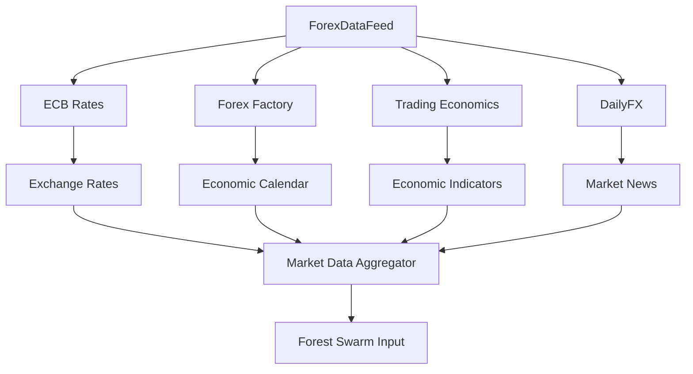
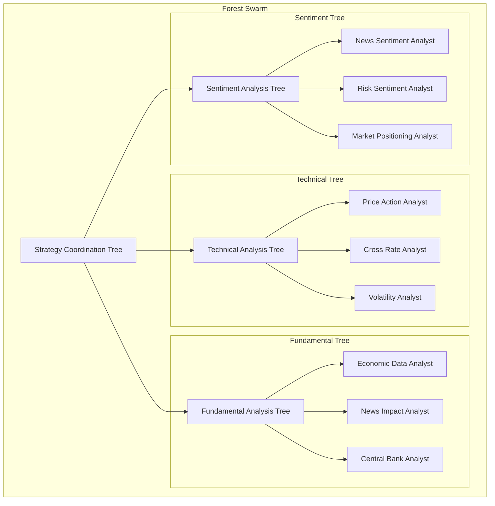
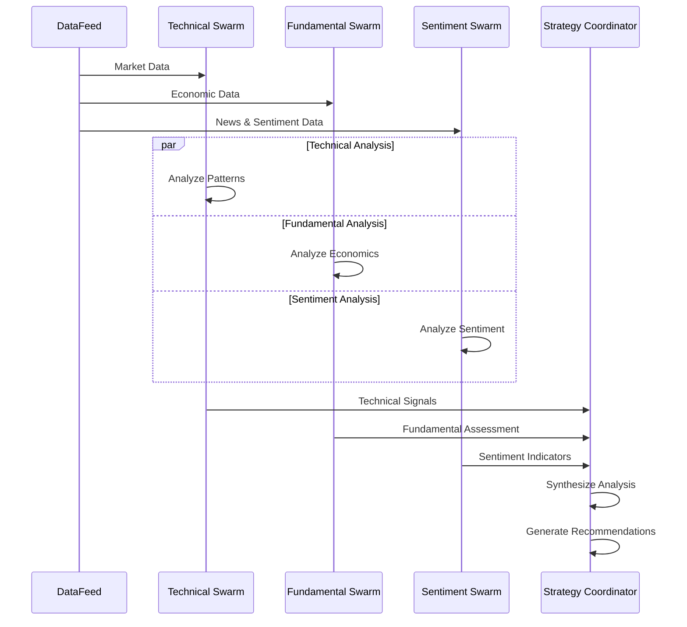

# Forex Forest System


[](https://discord.gg/agora-999382051935506503) [](https://www.youtube.com/@kyegomez3242) [](https://www.linkedin.com/in/kye-g-38759a207/) [](https://x.com/kyegomezb)


[](https://github.com/The-Swarm-Corporation/Legal-Swarm-Template)
[](https://github.com/kyegomez/swarms)


A sophisticated forex market analysis system using a swarm of specialized AI agents organized in a forest structure to provide comprehensive market insights and trading recommendations.

## Overview

The Forex Forest System combines real-time market data collection with distributed AI analysis through a multi-layered tree structure of specialized agents. Each agent focuses on specific aspects of market analysis, working together to generate holistic trading recommendations.

## System Architecture

### Data Collection Layer



The system collects data from multiple reliable sources:
- European Central Bank (ECB): Real-time exchange rates
- Forex Factory: Economic calendar events
- Trading Economics: Economic indicators and forecasts
- DailyFX: Market news and analysis

### Forest Swarm Structure



### Analysis Flow



## Features

### Modular Agent Structure
- Technical Analysis Tree
  - Price action analysis
  - Cross-rate correlations
  - Volatility assessment

- Fundamental Analysis Tree
  - Economic data evaluation
  - News impact analysis
  - Central bank policy tracking

- Sentiment Analysis Tree
  - News sentiment analysis
  - Risk sentiment monitoring
  - Market positioning assessment

- Strategy Coordination Tree
  - Signal synthesis
  - Risk management
  - Position sizing

### Real-time Data Processing
- Asynchronous data collection
- Multiple data source integration
- Automated data validation
- Error handling and logging

### Intelligent Analysis
- Multi-perspective market analysis
- Cross-validation of signals
- Risk-aware recommendations
- Continuous market monitoring

## Installation

```bash
# Clone the repository
git clone https://github.com/yourusername/forex-forest-system.git

# Install dependencies
pip install -r requirements.txt
```

Required dependencies:
- Python 3.8+
- aiohttp
- beautifulsoup4
- loguru
- swarms

## Usage

```python
from forex_forest import ForexForestSystem

async def main():
    # Initialize the system
    system = ForexForestSystem()
    
    # Start market monitoring
    await system.monitor_markets(interval_seconds=300)

if __name__ == "__main__":
    asyncio.run(main())
```

## Configuration

The system can be configured through environment variables:

```bash
FOREX_FOREST_LOG_LEVEL=INFO
FOREX_FOREST_INTERVAL=300  # Analysis interval in seconds
FOREX_FOREST_PAIRS=EUR/USD,GBP/USD,USD/JPY  # Comma-separated currency pairs
```

## Output Format

The system generates structured analysis output:

```json
{
    "timestamp": "2024-12-13T10:00:00Z",
    "recommendations": [
        {
            "pair": "EUR/USD",
            "action": "buy",
            "confidence": 8,
            "entry_points": [1.0850, 1.0830],
            "stop_loss": 1.0800,
            "take_profit": 1.0900,
            "rationale": "Strong technical setup with fundamental support"
        }
    ]
}
```

## Logging

The system uses structured logging with rotation:
- Log file: `forex_forest.log`
- Rotation: 500 MB
- Log level: Configurable through environment variables

## Error Handling

The system implements comprehensive error handling:
- Graceful degradation on data source failures
- Automatic retry mechanisms
- Detailed error logging
- Circuit breakers for external APIs

## Contributing

1. Fork the repository
2. Create your feature branch (`git checkout -b feature/AmazingFeature`)
3. Commit your changes (`git commit -m 'Add some AmazingFeature'`)
4. Push to the branch (`git push origin feature/AmazingFeature`)
5. Open a Pull Request

## License

This project is licensed under the MIT License - see the LICENSE file for details.
